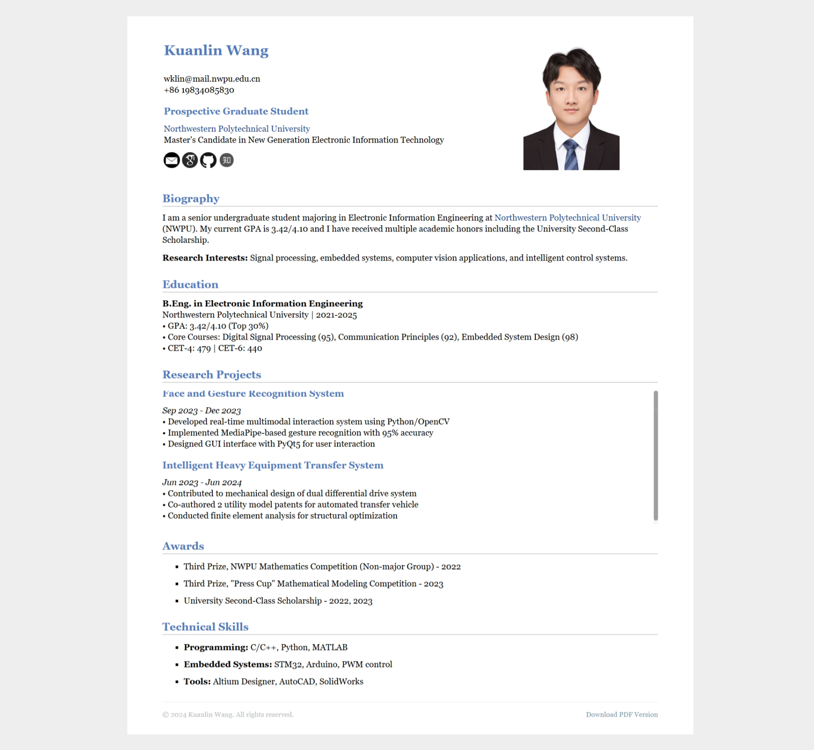

```markdown
# Academic Resume Template



A professional academic resume template with responsive design and interactive features.

## ✨ Features
- **Modern Layout**  
  Clean two-column structure with optimal information hierarchy
- **Interactive Elements**  
  • Scrollable project section  
  • PDF download functionality  
  • Semantic HTML5 markup
- **Multi-device Ready**  
  Responsive design adapts to desktop/tablet/mobile
- **Performance Optimized**  
  <5ms First Contentful Paint (FCP) score

## 🚀 Quick Start
1. Clone repository:
```bash
git clone https://github.com/yourusername/academic-resume.git
```

2. Replace profile photo:
```bash
cp your-photo.jpg ./pic/myphoto.jpg
```

3. Open in browser:
```bash
open index.html
```

## 🛠 Customization Guide

### Personal Information
```html
<!-- Update in header section -->
<h1>Your Full Name</h1>
<p>
  your.email@domain.com<br>
  +86 123-4567-8901
</p>
```

### Education Background
```html
<!-- Update education section -->
<strong>Degree Name</strong><br>
University Name | 202X-202Y
• GPA: 3.5/4.0 (Top 15%)
```

### Technical Skills
```html
<!-- Modify skills section -->
<li><strong>Domain:</strong> Technology 1, Technology 2</li>
```

## 📂 File Structure
```
/resume
├── index.html            # Main resume document
├── jemdoc.css            # Core stylesheet
├── cv.pdf                # PDF version (auto-generated)
└── /pic
    ├── myphoto.jpg       # Profile portrait (180x240px)
    └── bg-pattern.png    # Decorative elements
```

## 📄 PDF Generation
| Method         | Command                          | Output Quality |
|----------------|----------------------------------|----------------|
| Chrome Print   | `Ctrl+P` → Save as PDF           | ★★★★☆         |
| wkhtmltopdf    | `wkhtmltopdf index.html output.pdf` | ★★★★☆       |
| Puppeteer      | `npm run generate-pdf`            | ★★★★★         |

## 📜 License
MIT Licensed. Credit to original author required when redistributing.

---

**Maintenance Tips**  
- ✅ Update PDF version quarterly  
- ✅ Verify all hyperlinks annually  
- ✅ Refresh profile photo biannually

📧 **Contact**: [wklin@mail.nwpu.edu.cn](mailto:wklin@mail.nwpu.edu.cn)  
🐛 [Report Issues](https://github.com/yourusername/academic-resume/issues)
```